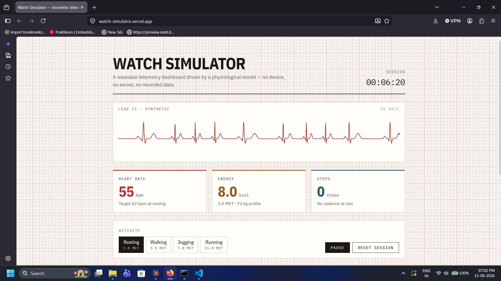

# Watch Simulator

A fitness-watch telemetry dashboard that runs entirely in the browser. Heart rate,
energy expenditure and step cadence are produced by a physiological model rather than
replayed from a recording, so the dashboard responds when you change activity — heart
rate climbs toward a new target over several seconds instead of jumping to it.

https://watch-simulator.vercel.app/ · Built with React, Vite and Recharts.



---

## Why it exists

Most dashboard demos bind a chart to a fixed JSON file. The interesting problems in a
live-telemetry UI only appear once the data actually moves: how often to re-render, how
to keep a 60 fps waveform from dragging the rest of the tree into its render cycle, and
how to make simulated numbers behave plausibly rather than randomly.

## The model

`src/lib/simulator.js` holds the whole model and imports nothing from React, so it can
be tested and reasoned about on its own.

- **Heart rate** eases exponentially toward an activity-dependent target rather than
  stepping to it, and carries a respiratory oscillation of a few bpm on a four-second
  cycle — wider at rest, as in a real trace.
- **Energy** uses the standard metabolic equation, `kcal/min = MET × 3.5 × kg / 200`,
  with MET values per activity (resting 1.0, walking 3.5, jogging 7.0, running 11.0).
- **Steps** accumulate fractionally from a per-activity cadence and only increment the
  visible counter on whole footfalls.
- **The ECG trace** is a sum of Gaussians standing in for the P wave, QRS complex and
  T wave. It is a caricature of a real trace, not a diagnostic one.

`step(session, dtMs)` is pure — same input, same output, no mutation — which keeps it
safe to call from an effect and trivial to test.

## Rendering at three different rates

The main architectural decision. Three consumers need the same data at very different
frequencies, so they get it three different ways:

| Consumer | Rate | Mechanism |
| --- | --- | --- |
| Physiological model | 20 Hz | `setInterval` in `useSimulation` |
| Metric cards, clock | 4 Hz | published to React state |
| Trend chart | 1 Hz | appended to a capped 90-point window |
| ECG waveform | ~60 Hz | `requestAnimationFrame`, reads a ref, paints to canvas |

Integrating the model once a second makes the heart-rate easing look stepped, so it
runs at 20 Hz. But re-rendering the dashboard 20 times a second is wasteful, so React
state is only published at 4 Hz. The waveform needs every frame, so it reads the live
session out of a ref and paints to a canvas — `EcgTrace` never re-renders after mount,
and the cards beside it are unaffected by it.

## Running locally

```bash
npm install
npm run dev
```

Then open the URL Vite prints. `npm run build` produces a static `dist/` directory.

## Deploying

The app is fully static — no backend, no environment variables. On Vercel, import the
repository and accept the detected Vite defaults (`npm run build`, output `dist`).

## Project layout

```
src/
  lib/simulator.js        the physiological model — no React
  hooks/useSimulation.js  drives the model, publishes state at a lower rate
  components/
    EcgTrace.jsx          canvas waveform, rAF, outside the render cycle
    MetricCard.jsx        one reading
    TrendChart.jsx        90-second heart-rate window (Recharts)
    ActivityControl.jsx   activity selector
  App.jsx
  index.css               design tokens and layout
```

## Design

The visual direction is clinical telemetry paper rather than the dark-mode-and-neon
convention of fitness apps: a 1 mm/5 mm ECG grid as the page background, IBM Plex
Condensed for readings and IBM Plex Mono for instrument labels, and a single stylus-red
accent reserved for the heart-rate trace.

## Not medical data

Every number on the page is generated by the model described above. Nothing here is a
measurement, and the ECG trace is not diagnostic.

## Possible next steps

- Unit tests for `step()` — the pure model is the easy part to cover first.
- Port to TypeScript; the session shape is the natural first interface.
- HRV estimate derived from the beat-to-beat interval.
- Persist a session and allow replay.
